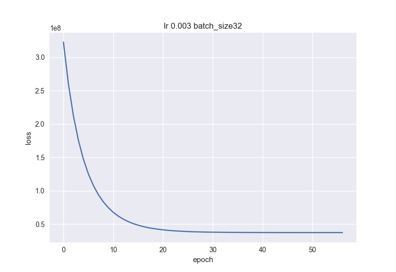
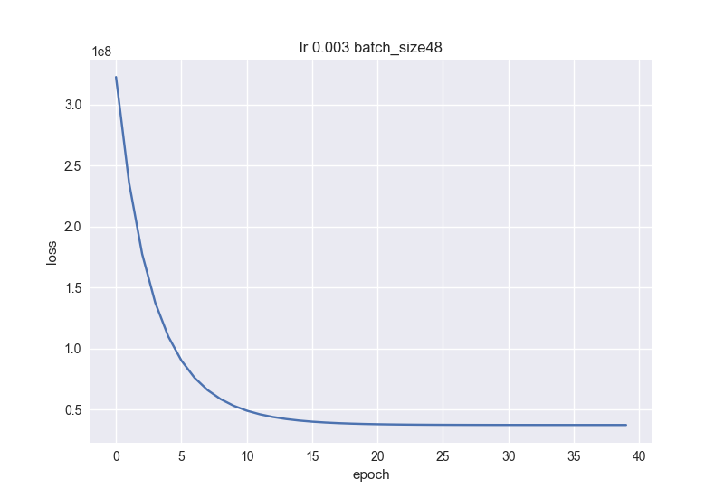
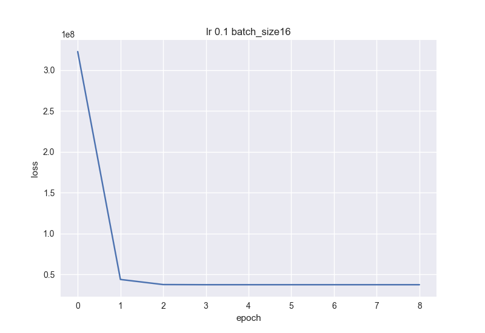
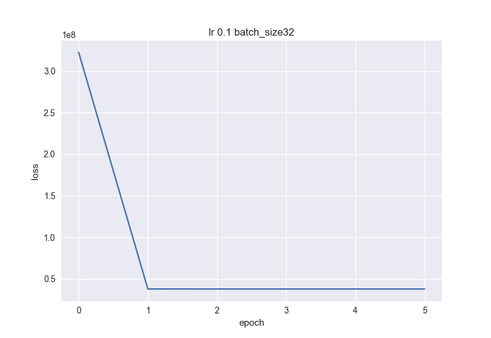
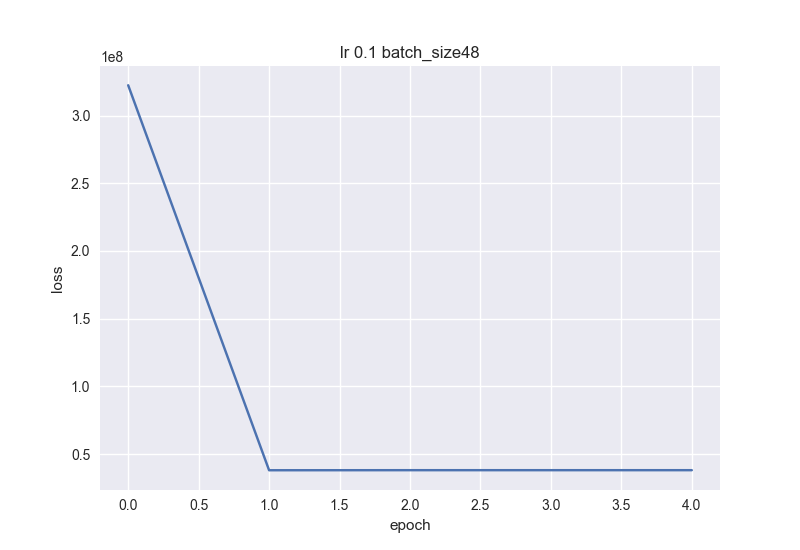
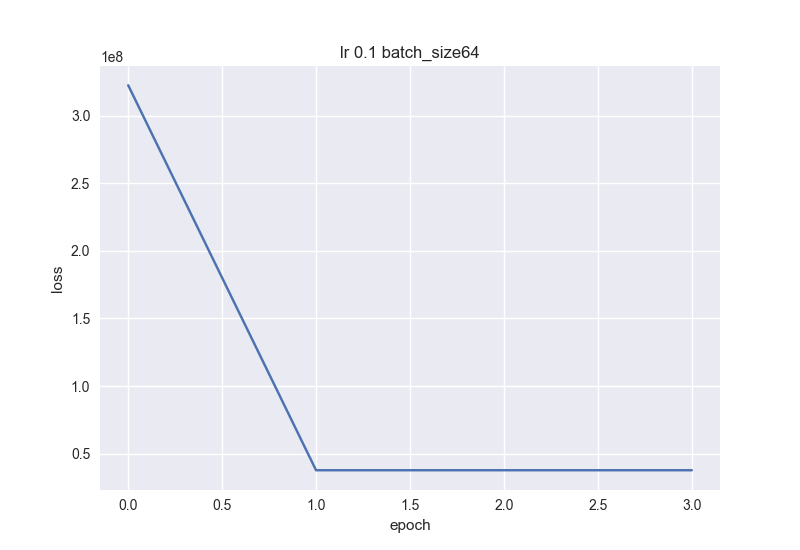
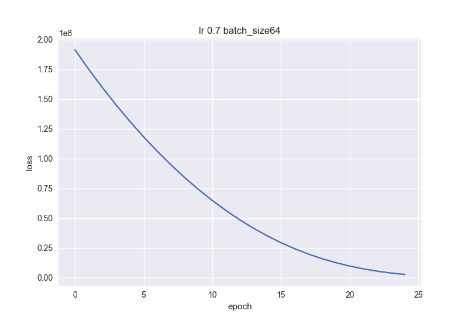
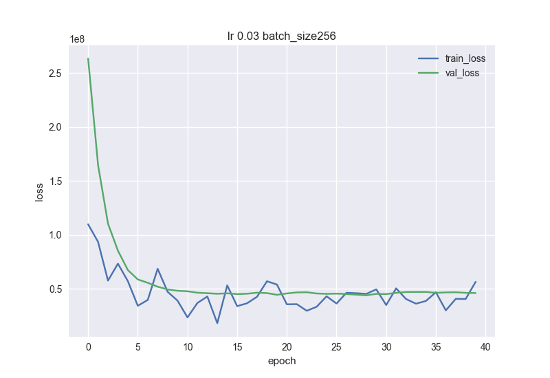

<b>Numpy vs Torch performance:</b> 
With the same results, numpy finishes 3 times faster than torch.  
 
<i>Numpy:</i> 
    <li> 0.006334 seconds </li>
<i>Torch:</i> 
    <li> 0.022298 seconds </li>
 
<b>CPU vs GPU torch speed:</b> 
 
Google colab was used as a service with gpu notebooks. 
 
<i>CPU:</i> 
    <li> 0.2782 seconds</li> 
<i>GPU:</i> 
    <li> 0.3216 seconds</li> 
 
 
<b>Performance profiling of different learning rates and batch sizes</b> 
Evaluation dataset used was insurance_train.csv. Tolerance was picked judging by the best convergence time. 
 
<b> Batch size 16, learning rate 0.003 </b> 
 
<i>Elapsed time:  0.12643694877624512 
Mean squared error : 37281232.0 
Mean absolute error : 4192.0986328125 
Explained Variance Score : 0.7417232990264893</i> 
 
<b> Batch size 32, learning rate 0.003 </b> 
 
<i>Elapsed time:  0.1248929500579834 
Mean squared error : 37283660.0 
Mean absolute error : 4203.05126953125 
Explained Variance Score : 0.7416884899139404</i> 
 
<b> Batch size 48, learning rate 0.003 </b> 
 
<i>Elapsed time:  0.10982012748718262 
Mean squared error : 37282084.0 
Mean absolute error : 4206.359375 
Explained Variance Score : 0.7416977882385254</i> 
 
<b> Batch size 64, learning rate 0.003 </b> 
 
<i>Elapsed time:  0.12246203422546387 
Mean squared error : 37278440.0 
Mean absolute error : 4203.87548828125 
Explained Variance Score : 0.741723895072937</i> 
 
 
 
<b> Batch size 16, learning rate 0.1 </b> 
 
<i>Elapsed time:  0.010492086410522461 
Mean squared error : 37298644.0 
Mean absolute error : 4214.109375 
Explained Variance Score : 0.7415899038314819</i> 
 
<b> Batch size 32, learning rate 0.1 </b> 
 
<i>Elapsed time:  0.013717889785766602 
Mean squared error : 37734364.0 
Mean absolute error : 4234.58154296875 
Explained Variance Score : 0.7388425469398499</i> 
 
<b> Batch size 48, learning rate 0.1 </b> 
 
<i>Elapsed time:  0.01411890983581543 
Mean squared error : 38075688.0 
Mean absolute error : 4250.453125 
Explained Variance Score : 0.7368855476379395</i> 
 
<b> Batch size 64, learning rate 0.1 </b> 
 
<i>Elapsed time:  0.015953779220581055 
Mean squared error : 37775532.0 
Mean absolute error : 4217.1513671875 
Explained Variance Score : 0.7387539148330688</i> 
 
 
<b> PyTorch results on same dataset </b>

<b> Batch size 64, learning rate 0.7, epochs 25, ADAM </b> 
 
<i>Elapsed time:  14.604433059692383 
Mean squared error : 43920040 
Mean absolute error : 4172.35302734375 
Explained Variance Score : 0.7299135327339172</i> 
 
<b> Batch size 256, learning rate 0.03, epochs 100, SGD, early_stopping </b> 
 
<i>Elapsed time:  0.8477602005004883 
Mean squared error : 38302136.0 
Mean absolute error : 4190.84840241255 
Explained Variance Score : 0.7348201853423612</i> 
 