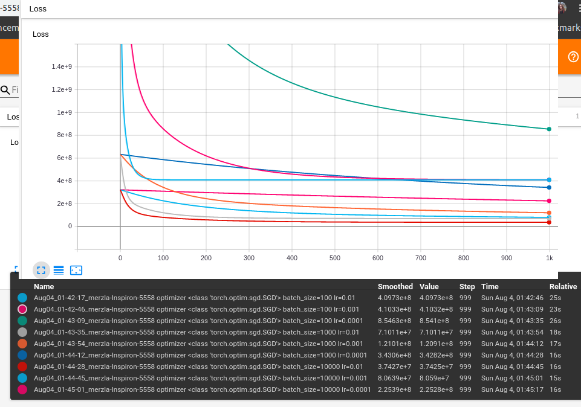

# Pytorch VS Numpy
Test your implementations on CPU:
 -   Compare the performance of NumPy and PyTorch implementations
 ` "lr": 1e-2,
    "epochs": 20000,
    "batch_size": 500`
        - numpy 2.2898855209350586s
        - pytorch  cpu 7.634106874465942s
   Train your models on GPU (script 1):
- Evaluate the speed up
   
    - pytorch  gpu 39.89904260635376s (_generally using gpu slows    down my training process, maybe something is wrong with my code_)
# Pytorch API
_everything slows down even more -\_-_

Try increasing or decreasing the batch size in your SGD, _report_ the impact on performance, speed of convergence, and metrics (accuracy, etc.). It is a good idea to plot the training process (loss vs. time) for different values of batch size and learning rate
